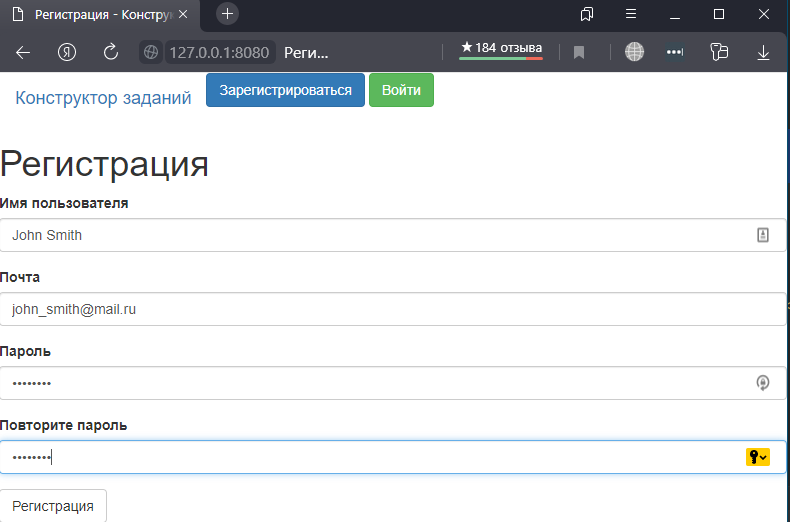
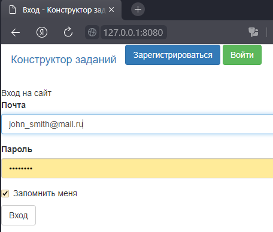
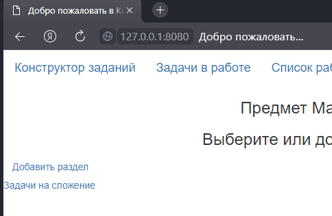
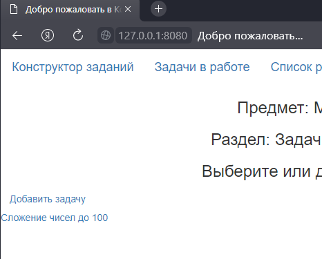
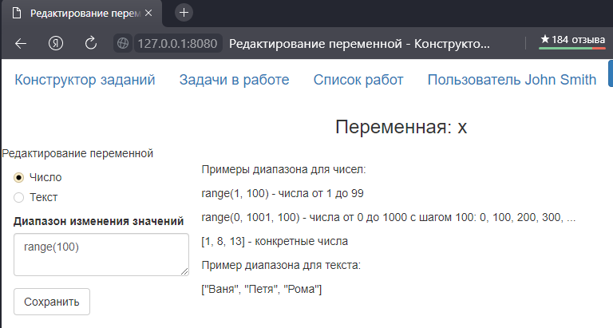
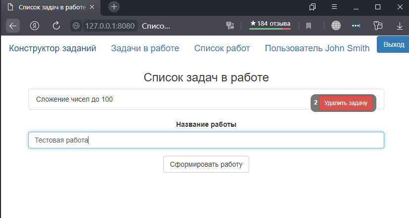
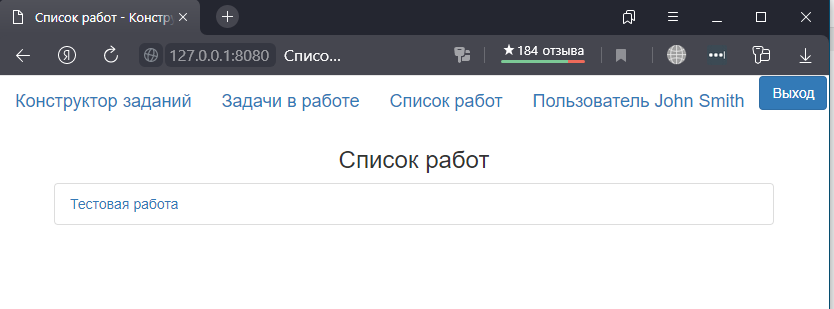
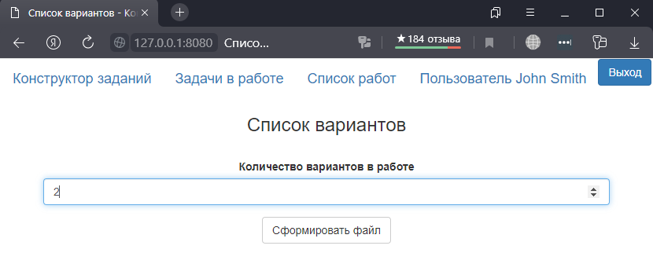
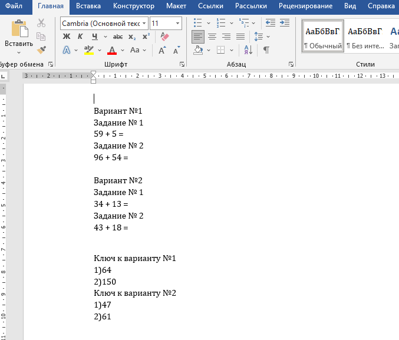

# maketaskonline

## Сайт для генерации вариативных заданий по различным предметам

Для просмотра на компьютере желательно использовать специализированное ПО, например, [Typora](https://typora.io/)

Сайт был создан как ответ всяческим ГДЗ, в которых приводятся готовые ответы на задания из учебников, задачников, и т.д.

С помощью моего сайта учитель легко может составить множество вариантов одного и того же задания которое не будет находится ни в одном ГДЗ

Работа с программой состоит из нескольких шагов. Рассмотрим их подробнее:

0. Запускающий файл программы main.py. После запуска в браузере нужно открыть адрес 127.0.0.1:8080

1. Для начала работы нужно войти на сайт, каждый пользователь имеет доступ только к своим заданиям.

2. После регистрации или входа нужно выбрать предмет и раздел(тему) в которой уже можно создавать задания.

3. Создание задания происходит в два этапа: 

   3.1.  Написание условия задания. Применяются переменные, имена переменных заключаются в фигурные скобки. Переменные применяются как для числовых так и для строковых значений(пример условия {x} + {y} = ?). Написание формулы для вычисления ответа к заданию. Здесь также применяются переменные в фигурных скобках (пример формулы {x} + {y})

   3.2. Описание переменных и диапазонов их значений, для диапазонов можно применять range и списки.(Например для предыдущих переменных нужно указать числовой тип и диапазон range(20, 50)), примеры приводятся на странице редактирования переменных

4. После создания заданий их можно добавлять в работу(набор задач), для этого нужно выбрать количество задач этого типа и нажать кнопку "Добавить задачи в работу". При этом происходит переход на страницу "Задачи в работе" для просмотра и редактирования

5. Когда все нужные задачи добавлены в работу, работа формируется с помощью нажатия кнопки "Сформировать работу", для сохранения работы нужно присвоить ей имя.

6. После этого происходит переход к списку работ. Выбирается работа, на странице этой работы указываем нужное количество вариантов и нажимаем кнопку "Сформировать файл".

7. После создания варианта он отображается на вкладке работы и его можно скачивать.

Теперь то же самое но с примерами в виде скриншотов:

1. Начальная страница незарегистрированного пользователя

   

2. Регистрация

   

3. Вход

   

4. Начальная страница зарегистрированного пользователя

   

5. Добавляем предмет:

   

6. Выбираем предмет и переходим к разделам

   

   

7. Создание раздела

   

8. Выбираем раздел для создания задач

   

9. Страница добавления задач в раздел

   

   10.Добавление задачи, описываем условие и формулу для вычисления ответа

   

   11.Выбираем задачу для редактирования переменных и добавления ее в работу

   

   12.Страница задачи

   

   13.Страница редактирования переменных

   

   

   

   14.Добавление задачи в работу

   

   

   15.Страница задач в работе. Здесь можно удалить задачи из работы или сформировать работу

   

   16.Страница со списком готовых работ

   

   

   17.Страница работы на которой создаются варианты

   

   18.Страница работы после создания варианта

   

   19.Готовый вариант в файле Word

   
   
   ## Приложение
   
   Схема данных 
   
   

